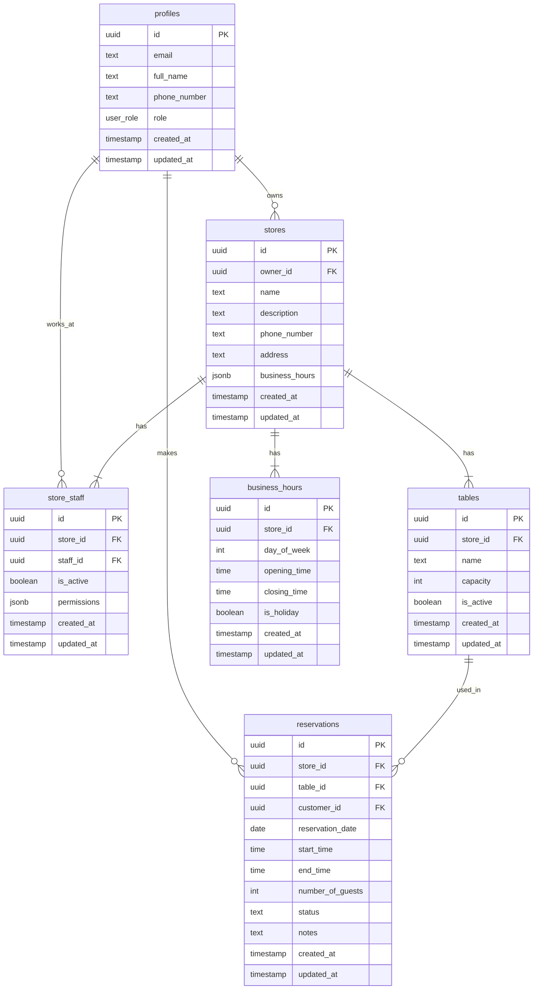

# YoyakuHub Database ER Diagram

## リレーションシップの説明

1. `profiles` (ユーザープロファイル)
   - 店舗オーナー、スタッフ、顧客の情報を管理
   - `role`で役割を区別（owner/staff/customer）

2. `stores` (店舗)
   - `owner_id`で店舗オーナーとの関連を管理
   - 1人のオーナーは複数の店舗を持つことが可能

3. `store_staff` (店舗スタッフ)
   - 店舗とスタッフの中間テーブル
   - スタッフの権限管理も行う

4. `tables` (テーブル情報)
   - 各店舗の座席情報を管理
   - `capacity`で収容人数を管理

5. `reservations` (予約)
   - 予約情報を管理
   - 店舗、テーブル、顧客との関連を持つ

6. `business_hours` (営業時間)
   - 店舗ごとの営業時間を管理
   - 曜日ごとに異なる営業時間の設定が可能